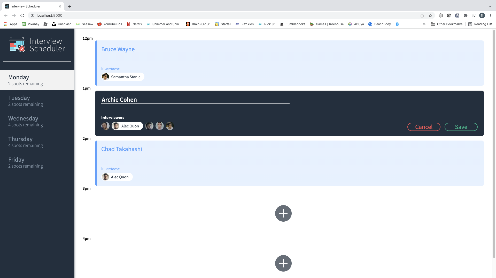
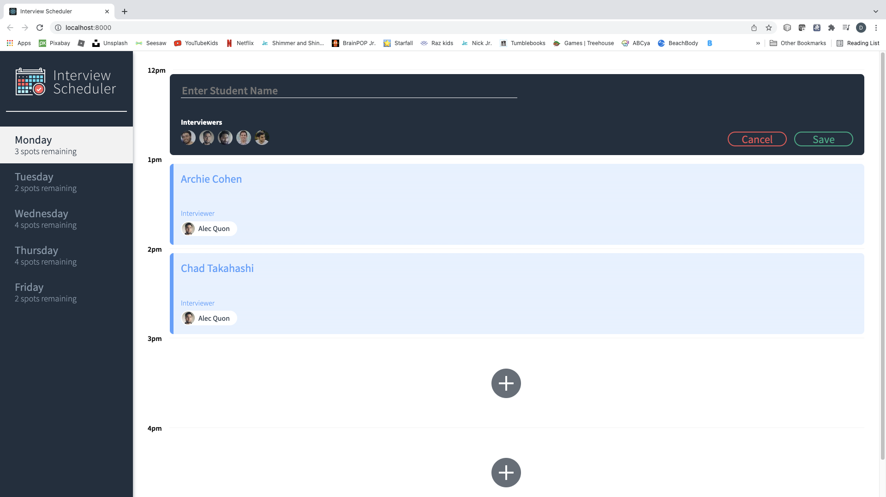
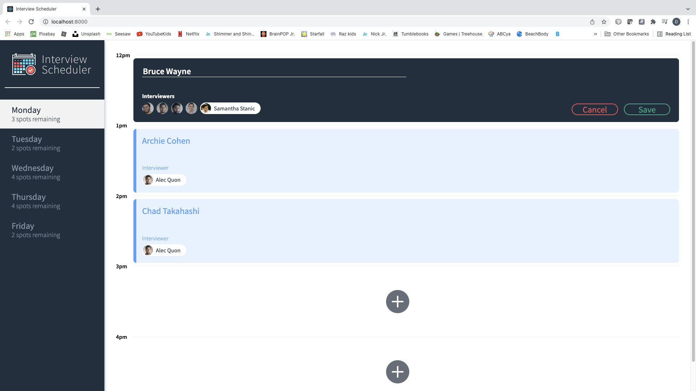
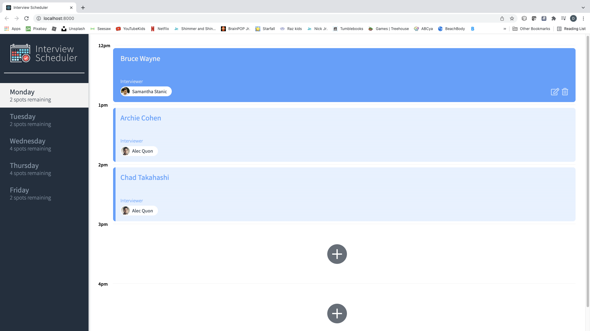
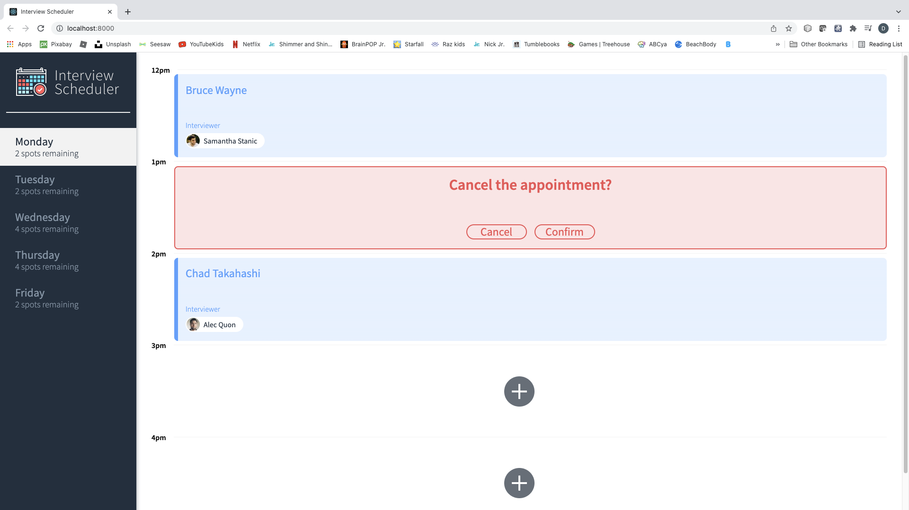
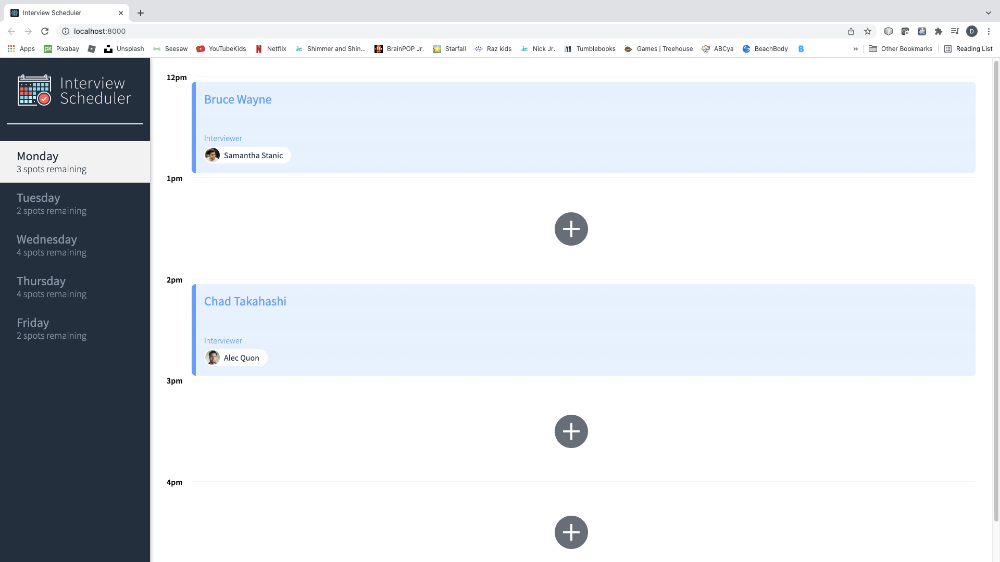

# Interview Scheduler
React app running with a PostgreSQL back end that allows people to schedule interviews.  Interviewers are evaluated by day and rendered dynamically to the creation form depending on their availability.  Test running done with Jest for unit testing and Cypress for end-to--end testing.  Main branch incorporates basic functionality in order to pass tests as designated by compass.  Basic visual unit tesing done with Storybook prior to larger integration.

Developed in conjunction with scheduler-api which is also available at my deke76 repository.

## Setup

Install dependencies with `npm install`.  Requires an installed version of scheduler-api (https://github.com/deke76/scheduler-api)

Dependencies include axios, normalize and react.

## Running Webpack Development Server

```sh
npm start
```

## Running Jest Test Framework

```sh
npm test
```

## Running Storybook Visual Testbed

```sh
npm run storybook
```

## Scripts available
Scripts setup include: start, build, test, eject, storybook, build-storybook, cypress.  As a reminder any script can be run with ```npm run <script>```.

## Screenshots









## Run Instructions
Start locally by ruunning npm start which will start an instance at port 8000 for the client in the scheduler directory.  

The server requires npm start to fire up in development mode while ```npm run test:server``` fires a test server and ```npm run error``` to verify axios error catching in the schduler-api director.

Server dependincies include body parser, cors, dotenv, express, helmet, pg, socket.io and ws.

Jest and Cypress base files are included as part of the project.
